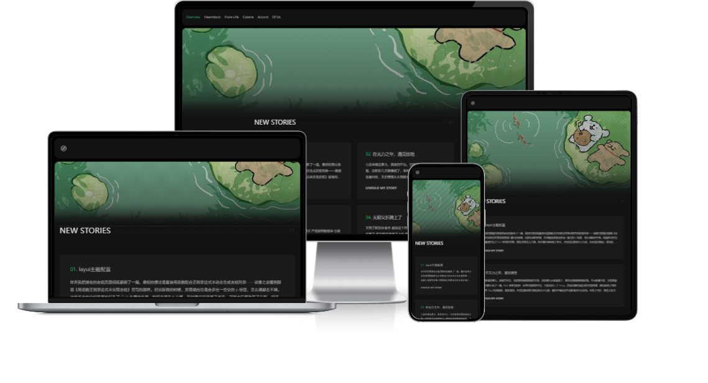

<p align="center">
  
</p>

# EverUs - Halo 2.0 暗色杂志风格主题

[](https://halo.run)
[](LICENSE)
[](theme.yaml)
[](https://github.com/imorisun/halo-theme-everus/actions/workflows/cd.yaml)

EverUs 是一款为 Halo 2.0 打造的**暗色系杂志风格**博客主题，从 [JaneLens/EverUs](https://github.com/JaneLens/EverUs)（Typecho 版）移植并魔改而来。主题以深邃的黑色为基底，搭配绿色点缀，融入页面过渡动画与 GSAP 滚动动效，呈现沉浸式的阅读体验。

***

## 目录

- [核心功能](#核心功能)
- [功能模块详解](#功能模块详解)
  - [首页](#首页)
  - [文章页](#文章页)
  - [自定义页面](#自定义页面)
  - [分类与标签](#分类与标签)
  - [归档页](#归档页)
  - [作者页](#作者页)
  - [瞬间（动态）页](#瞬间动态页)
  - [友链页](#友链页)
  - [导航菜单](#导航菜单)
  - [音乐播放器](#音乐播放器)
  - [评论系统](#评论系统)
  - [页脚](#页脚)
- [技术架构](#技术架构)
- [环境要求](#环境要求)
- [安装指南](#安装指南)
- [主题配置](#主题配置)
- [第三方插件与依赖](#第三方插件与依赖)
- [项目目录结构](#项目目录结构)
- [开发指南](#开发指南)
- [常见问题解答](#常见问题解答)
- [贡献指南](#贡献指南)
- [版权信息](#版权信息)

***

## 核心功能

- **暗色视觉风格** — 黑色基底 + 绿色点缀（`#26a760`），低亮度护眼阅读
- **GSAP 滚动动画** — 内容区域随页面滚动淡入，Paragraph 逐条出现，回滚可逆
- **APlayer 音乐播放器** — 支持网易云音乐 / QQ 音乐歌单，支持自定义直链歌单
- **Fancybox 图片灯箱** — 文章封面点击全屏预览，支持幻灯片切换
- **Halo 瞬间插件集成** — 首页展示最新动态，瞬间专页支持标签筛选与点赞
- **Halo 友链插件集成** — 友链卡片网格，支持分组筛选
- **响应式布局** — 适配桌面与移动端
- **自定义字体** — 支持通过 URL 加载自定义 woff2/woff/ttf/eot/svg 字体
- **面包屑导航** — 分类 / 标签 / 作者 / 瞬间等页面均配备层级导航
- **自定义页脚** — 支持自定义文字与 ICP 备案号

***

## 功能模块详解

### 首页

首页采用 **杂志式模块化布局**，从上至下依次排列：

| 区块         | 说明                            | 数据来源                                      |
| ---------- | ----------------------------- | ----------------------------------------- |
| **Banner** | 全宽背景图横幅，默认为暗色渐变，可自定义          | `settings.yaml` → `homepage.banner_image` |
| **最新文章**   | 列表展示最新文章标题、摘要，并显示文章总数         | `postFinder.list()`                       |
| **最新动态**   | 瞬间插件的最近 6 条动态（需安装 Moments 插件） | `momentFinder.list(1, 6)`                 |
| **结语引用**   | 固定文案模块，引导用户继续浏览               | 静态文本                                      |

示例代码（[index.html](file:///c:/Users/19002/Documents/Trae/halo-theme-everus/templates/index.html)）：

```html
<th:block th:if="${posts?.items != null and not posts.items.isEmpty()}">
  <li class="cat-posts__item up" th:each="post,iterStat : ${posts.items}">
    <h3 class="line-clamp">
      <span class="accent"></span>
      <a class="link hover-link" th:href="@{${post?.status?.permalink}}"
         th:text="${post?.spec?.title}"></a>
    </h3>
    <p class="line-clamp" th:if="${post?.status?.excerpt}"
       th:text="${post?.status?.excerpt}"></p>
    <a class="link hover-link" th:href="@{${post?.status?.permalink}}">展开我的故事</a>
  </li>
</th:block>
```

### 文章页

文章页提供完整的阅读体验：

- **封面图** — 带 Fancybox 灯箱，点击放大预览
- **分类 & 标签** — 文章详述区域顶部展示
- **正文渲染** — 通过 `th:utext` 渲染 HTML 正文
- **作者与发布时间**
- **评论区域** — 集成 Halo 评论组件

### 自定义页面

独立页面与文章页共享相同的布局结构，适用于「关于」、「留言」等静态页面。

### 分类与标签

| 页面   | 路由                   | 说明                                |
| ---- | -------------------- | --------------------------------- |
| 全部分类 | `/categories`        | 卡片网格布局，展示封面、名称、描述、文章数             |
| 分类详情 | `/categories/{slug}` | Hero 大图 + 文章卡片网格 + 侧边栏            |
| 全部标签 | `/tags`              | 标签云（Tag Cloud），颜色取自标签自身设定         |
| 标签详情 | `/tags/{slug}`       | 与分类详情一致的 Hero + 网格 + 侧边栏布局，标签色主题化 |

**侧边栏**（分类/标签/作者详情页共用）：

- 统计卡片（文章数 / 页数）
- 分类描述或作者简介
- 快捷导航链接

### 归档页

**路由**：`/archives`

按**年份→月份→文章**三级层级展示全部文章列表，已读数量一目了然。支持分页。

### 作者页

**路由**：`/authors/{name}`

展示作者头像、显示名、简介、邮箱、电话等信息，以及该作者所有文章的卡片网格。

### 瞬间（动态）页

**路由**：`/moments`

> 需安装 [Halo Moments 插件](https://github.com/halo-sigs/plugin-moments)

- Hero 头部显示动态总数
- **标签筛选** — 按 Moment Tag 筛选瞬间
- 每条瞬间展示：用户头像/昵称/时间、HTML 正文、图片/视频媒体
- **点赞** — 通过 `/apis/api.halo.run/v1alpha1/trackers/upvote` API 实现，点赞状态存储在 `localStorage`
- **内联评论** — 每条瞬间折叠式评论区域

### 友链页

**路由**：`/links`

> 需安装 [Halo Links 插件](https://github.com/halo-sigs/plugin-links)

- Hero 头部显示链接总数
- **分组筛选** — 按链接分组切换显示
- 链接卡片网格：Logo（首字母回退）、名称、描述、外链箭头

### 导航菜单

主题自动读取 Halo 主菜单（`menuFinder.getPrimary()`），在顶部导航栏渲染菜单项，并高亮当前活跃页面。移动端通过汉堡按钮切换菜单。

### 音乐播放器

主题内置 APlayer 播放器，支持两种歌单来源：

1. **自定义歌单** — 在主题设置中按行填写 `歌名 | 歌手 | 音频直链 | 封面直链`，精确控制每首歌曲
2. **平台歌单** — 填写网易云音乐 / QQ 音乐的歌单 ID，通过 [Meting API](https://api.i-meto.com/meting/api) 自动拉取

播放器放置在页面底部，带**歌单面板**（侧边滑出），支持查看歌曲列表并点击切歌。

### 评论系统

使用 Halo 评论组件 `<halo:comment />`，自动适配 Post、SinglePage、Moment 等多种内容类型的评论。

### 页脚

- 支持自定义页脚文字（替换默认版权声明）
- 支持 ICP 备案号及链接到工信部备案查询
- 通过 `<halo:footer />` 注入插件代码

***

## 技术架构

### 整体架构图

```
┌─────────────────────────────────────────────────────┐
│                     Halo 2.0 CMS                     │
│  (Spring Boot + WebFlux + Thymeleaf 模板引擎)         │
├─────────────────────────────────────────────────────┤
│                   EverUs Theme                        │
├───────────────┬─────────────────────────────────────┤
│   templates/  │          静态资源 assets/              │
│ ───────────── │ ──────────────────────────────────── │
│ layout.html   │ css/style.css       (主题全局样式)     │
│ index.html    │ css/icon.css        (图标字体)         │
│ post.html     │ js/main.js          (核心交互逻辑)     │
│ page.html     │ js/aplayer/         (音乐播放器)️       │
│ category.html │ images/             (默认图片素材)     │
│ categories..  │                                          │
│ tag.html      │                                          │
│ tags.html     │                                          │
│ archives.html │                                          │
│ author.html   │                                          │
│ moments.html  │                                          │
│ links.html    │                                          │
├───────────────┴─────────────────────────────────────┤
│               第三方 CDN 依赖                          │
│ ──────────────────────────────────────────────────── │
│ jQuery 3.7.1 · Fancybox 5.0.36 · GSAP 3.12.5       │
│ APlayer + Meting2 (本地打包)                          │
└─────────────────────────────────────────────────────┘
```

### 模板引擎

主题基于 **Thymeleaf 3.0.12**，使用 Halo 提供的模板变量和 Finder API 查询数据：

- `postFinder` — 查询文章
- `categoryFinder` — 查询分类
- `tagFinder` — 查询标签
- `menuFinder` — 查询导航菜单
- `momentFinder` — 查询瞬间（需插件）
- `singlePageFinder` — 查询自定义页面
- `pluginFinder` — 检测插件可用性

### 前端交互

核心 JavaScript ([main.js](file:///c:/Users/19002/Documents/Trae/halo-theme-everus/templates/assets/js/main.js)) 实现：

| 功能    | 实现方式                                                  |
| ----- | ----------------------------------------------------- |
| 滚动动画  | GSAP ScrollTrigger — `gsap.fromTo()` 元素随滚动淡入          |
| 图片灯箱  | Fancybox 5 — 绑定 `[data-fancybox="gallery"]`           |
| 返回顶部  | jQuery animate — 平滑滚动到顶部                              |
| 移动端菜单 | CSS class toggle — `nav-open` 切换                      |
| 音乐播放器 | APlayer + Meting2 API + 自定义歌单面板                       |
| 瞬间点赞  | XMLHttpRequest → Halo Upvote API + localStorage 状态持久化 |
| 瞬间评论  | CSS `is-expanded` class 折叠展开                          |

### 构建与发布

- **打包**：`pnpm build` → `@halo-dev/theme-package-cli` 生成 ZIP
- **CI/CD**：GitHub Actions 使用 `halo-sigs/reusable-workflows` 的 `theme-cd.yaml`，在 Release 时自动构建并发布到 Halo 应用市场

***

## 环境要求

| 依赖            | 版本       |
| ------------- | -------- |
| Halo          | ≥ 2.19.0 |
| Node.js（仅打包时） | ≥ 18     |
| pnpm（仅打包时）    | ≥ 8      |

### 推荐安装的 Halo 插件

| 插件                                                                          | 用途     | 备注                      |
| --------------------------------------------------------------------------- | ------ | ----------------------- |
| [plugin-comment-widget](https://github.com/halo-sigs/plugin-comment-widget) | 评论组件   | 必须安装才能使用评论功能            |
| [plugin-moments](https://github.com/halo-sigs/plugin-moments)               | 瞬间（动态） | 可选，首页动态 & `/moments` 页面 |
| [plugin-links](https://github.com/halo-sigs/plugin-links)                   | 友情链接   | 可选，`/links` 页面          |
| [plugin-search-widget](https://github.com/halo-sigs/plugin-search-widget)   | 搜索组件   | 可选，全局搜索                 |

***

## 安装指南

### 方式一：从 Halo 应用市场安装

1. 登录 Halo Console
2. 进入 **外观 → 主题管理**
3. 搜索 **EverUs** 并点击安装
4. 安装完成后点击 **启用**

### 方式二：手动上传安装

1. 从 [Releases](https://github.com/imorisun/halo-theme-everus/releases) 下载最新 ZIP 包
2. 登录 Halo Console → **外观 → 主题管理**
3. 点击 **安装主题** → **上传 ZIP**，选择下载的文件
4. 安装完成后启用

### 方式三：本地开发安装

```bash
# 克隆仓库到 Halo 主题目录
git clone https://github.com/imorisun/halo-theme-everus.git \
  ~/.halo2/themes/halo-theme-everus

# 重启 Halo，然后到 Console → 主题管理中启用
```

***

## 主题配置

在 Halo Console → **外观 → 主题管理 → EverUs → 设置** 中，可进行以下配置：

### 样式与字体

| 配置项       | 说明                                  | 示例值                              |
| --------- | ----------------------------------- | -------------------------------- |
| 自定义字体 URL | 字体文件的直链地址，支持 woff2/woff/ttf/eot/svg | `https://example.com/font.woff2` |

### 首页

| 配置项        | 说明                  | 示例值       |
| ---------- | ------------------- | --------- |
| Banner 背景图 | 首页顶部 Banner 的背景图片附件 | 在附件库中选择图片 |

### 页脚

| 配置项     | 说明                | 示例值                        |
| ------- | ----------------- | -------------------------- |
| 自定义页脚文字 | 替换默认版权声明的自定义文字    | `Copyright © 2024 My Blog` |
| ICP 备案号 | 网站备案号（自动链接到工信部查询） | `京ICP备2024XXXXXX号-1`       |

### 音乐播放器

| 配置项     | 说明                                 | 示例值                                       |
| ------- | ---------------------------------- | ----------------------------------------- |
| 自定义歌单   | 每行一首，格式：`歌名 \| 歌手 \| 音频直链 \| 封面直链` | `晴天 \| 周杰伦 \| https://... \| https://...` |
| 平台歌单 ID | 网易云 / QQ 音乐歌单 ID                   | `7539827971`                              |
| 音乐平台    | 选择 `netease`（网易云）或 `tencent`（QQ音乐） | `netease`                                 |

> **提示**：自定义歌单优先级高于平台歌单。若同时填写，只使用自定义歌单。

***

## 第三方插件与依赖

### 运行时 CDN 依赖

| 名称                                            | 版本     | 加载方式         | 用途          |
| --------------------------------------------- | ------ | ------------ | ----------- |
| [jQuery](https://jquery.com/)                 | 3.7.1  | jsDelivr CDN | DOM 操作基础库   |
| [Fancyapps UI](https://fancyapps.com/)        | 5.0.36 | jsDelivr CDN | 图片灯箱预览      |
| [GSAP](https://gsap.com/)                     | 3.12.5 | jsDelivr CDN | 专业级滚动动画引擎   |
| [APlayer](https://aplayer.js.org/)            | —      | 本地打包         | HTML5 音乐播放器 |
| [Meting2](https://github.com/metowolf/Meting) | —      | 本地打包         | 音乐平台 API 桥接 |

### 开发/构建依赖

| 名称                                                                           | 版本     | 用途              |
| ---------------------------------------------------------------------------- | ------ | --------------- |
| [@halo-dev/theme-package-cli](https://github.com/halo-dev/theme-package-cli) | ^1.0.0 | 主题打包工具          |
| [Thymeleaf](https://www.thymeleaf.org/)                                      | 3.0.12 | 模板引擎（Gradle 依赖） |
| [pnpm](https://pnpm.io/)                                                     | ≥ 8    | 包管理器            |

### 构建工具链

项目使用 Gradle（Java 生态）+ pnpm（前端打包）双构建工具：

```gradle
// build.gradle — 声明 Thymeleaf 依赖用于本地开发
dependencies {
  implementation('org.thymeleaf:thymeleaf:3.0.12.RELEASE')
}
```

### GitHub Actions CI/CD

CI/CD 流水线复用 Halo 官方可复用工作流（[halo-sigs/reusable-workflows](https://github.com/halo-sigs/reusable-workflows)），在 Release 发布时自动触发：

- 构建并生成主题 ZIP 包
- 上传到 GitHub Release Assets
- 自动发布到 Halo 应用市场

***

## 项目目录结构

```
halo-theme-everus/
├── .github/
│   └── workflows/
│       └── cd.yaml              # GitHub Actions CD 流水线
├── gradle/
│   └── wrapper/                 # Gradle Wrapper
├── templates/                   # Thymeleaf 模板文件
│   ├── layout.html              # 全局布局（导航、页脚、播放器）
│   ├── index.html               # 首页
│   ├── post.html                # 文章详情页
│   ├── page.html                # 自定义页面
│   ├── category.html            # 分类详情页
│   ├── categories.html          # 全部分类页
│   ├── tag.html                 # 标签详情页
│   ├── tags.html                # 全部标签页
│   ├── archives.html            # 归档页
│   ├── author.html              # 作者页
│   ├── moments.html             # 瞬间动态页
│   ├── links.html               # 友链页
│   └── assets/
│       ├── css/
│       │   ├── style.css        # 主题全局样式
│       │   └── icon.css         # 图标字体样式
│       ├── js/
│       │   ├── main.js          # 核心交互逻辑
│       │   └── aplayer/         # 音乐播放器相关文件
│       │       ├── APlayer.min.css
│       │       ├── APlayer.min.js
│       │       └── Meting2.min.js
│       └── images/
│           ├── avatar.jpg       # 默认头像
│           ├── bg.jpg           # 默认背景图
│           └── favicon.ico      # 网站图标
├── theme.yaml                   # 主题元数据（名称、版本、作者等）
├── settings.yaml                # 主题设置表单定义
├── screenshot.png               # 主题缩略图
├── build.gradle                 # Gradle 构建配置
├── settings.gradle              # Gradle 项目设置
├── package.json                 # pnpm 配置 & 打包脚本
├── pnpm-lock.yaml               # pnpm 依赖锁文件
└── LICENSE                      # GPL-3.0 许可证
```

***

## 开发指南

### 本地开发环境

1. **安装依赖**
   ```bash
   # Gradle（Java 后端）
   cd halo-theme-everus
   ./gradlew clean build

   # pnpm（前端打包）
   pnpm install
   ```
2. **将主题链接到 Halo**

   将项目目录放在 Halo 工作目录的 `themes/` 下，确保文件夹名与 `theme.yaml` 中 `metadata.name` 一致：
   ```bash
   # 假设 Halo 工作目录为 ~/.halo2
   ln -s $(pwd) ~/.halo2/themes/halo-theme-everus
   ```
3. **启动 Halo 开发模式**

   设置 Thymeleaf 缓存关闭以便模板修改即时生效：
   ```bash
   # Docker 方式
   docker run ... -e SPRING_THYMELEAF_CACHE=false ...

   # 源码方式
   spring.thymeleaf.cache=false
   ```
4. **访问 Halo Console → 主题管理**，启用 **EverUs** 主题

### 模板开发参考

| 场景         | 参考文件                                                 |
| ---------- | ---------------------------------------------------- |
| 主题配置       | `theme.yaml`、`settings.yaml`                         |
| 模板变量       | Halo 官方文档：每个模板的可用变量                                  |
| Finder API | `postFinder`、`categoryFinder` 等                      |
| 全局变量       | `site`、`theme`、`#theme.assets()`                     |
| 静态资源引用     | `#theme.assets('/images/bg.jpg')`                    |
| 评论标签       | `<halo:comment group="..." kind="..." name="..." />` |
| 页脚注入       | `<halo:footer />`                                    |

### 打包发布

```bash
# 构建主题 ZIP 包
pnpm build

# 产物输出至 dist/ 目录
```

***

## 常见问题解答

### Q: 安装主题后，页面没有显示样式？

A: 请确认主题已正确**启用**。在 Halo Console → 外观 → 主题管理中，点击主题下方的「启用」按钮。

### Q: 瞬间页面显示为空？

A: 需要安装并启用 [Halo Moments 插件](https://github.com/halo-sigs/plugin-moments)，并至少发布一条瞬间内容。

### Q: 友链页面不显示内容？

A: 需要安装并启用 [Halo Links 插件](https://github.com/halo-sigs/plugin-links)，并在插件中添加友链。

### Q: 评论组件不显示？

A: 请确保已安装 [Halo Comment Widget 插件](https://github.com/halo-sigs/plugin-comment-widget)。该组件是 Web Component，首次加载时可能需要一定时间初始化。

### Q: 音乐播放器没有声音？

A: 请检查以下几个方面：

- 使用平台歌单时，确认歌单 ID 正确且可公开访问
- 使用自定义歌单时，确认音频直链可跨域访问（CORS）
- QQ 音乐部分歌曲可能因版权限制无法播放

### Q: Banner 背景图如何更换？

A: 在 Halo Console → 外观 → EverUs 设置 → 首页中上传新的 Banner 背景图附件。

### Q: 图标字体如何更新？

A: 主题使用自定义图标字体 `icon.css`，如需添加新图标，需要重新生成字体文件并替换 `assets/css/icon.css` 中的字形映射。

### Q: 本地开发时模板修改不生效？

A: 确保设置了 `SPRING_THYMELEAF_CACHE=false`（Docker 环境变量）或 `spring.thymeleaf.cache: false`（配置文件），否则 Thymeleaf 会缓存模板。

***

## 贡献指南

欢迎对本主题贡献代码、报告问题或提出改进建议！

### 贡献流程

1. **Fork** 本仓库
2. 创建特性分支：`git checkout -b feature/awesome-feature`
3. 提交更改：`git commit -m 'Add awesome feature'`
4. 推送到分支：`git push origin feature/awesome-feature`
5. 发起 **Pull Request**

### Issue 报告

请在 [Issues](https://github.com/imorisun/halo-theme-everus/issues) 页面提交问题，建议包含以下信息：

- Halo 版本号
- 主题版本号
- 问题描述（截图 + 复现步骤）
- 浏览器及版本

### 代码风格

- 缩进：2 空格（HTML / CSS / JS）
- CSS 使用 BEM 命名约定（`.cat-group__item`、`.post-card__link`）
- JavaScript 使用 IIFE 包裹避免全局污染
- Thymeleaf 模板遵循安全导航运算符（`?.`）避免空指针

***

## 版权信息

**EverUs** Halo 主题由 [晨阳](https://www.puresky.top) 开发，基于原 Typecho EverUs 主题移植。

本项目采用 **[GNU General Public License v3.0](LICENSE)** 开源许可协议。

```
EverUs - A dark-themed Halo blog theme
Copyright (C) 2024 晨阳

This program is free software: you can redistribute it and/or modify
it under the terms of the GNU General Public License as published by
the Free Software Foundation, either version 3 of the License, or
(at your option) any later version.

This program is distributed in the hope that it will be useful,
but WITHOUT ANY WARRANTY; without even the implied warranty of
MERCHANTABILITY or FITNESS FOR A PARTICULAR PURPOSE.
See the GNU General Public License for more details.
```

### 致谢

- [Halo](https://halo.run) — 强大易用的开源建站工具
- [JaneLens/EverUs](https://github.com/JaneLens/EverUs) — Typecho 版原始主题，提供设计灵感与视觉基础

