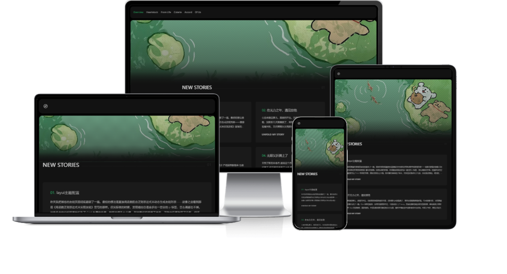

<div align="center">

# EverUs

**一款暗色系杂志风格的 Halo 博客主题**

[](https://halo.run)
[](https://github.com/imorisun/halo-theme-everus/releases)
[](LICENSE)
[](https://github.com/imorisun/halo-theme-everus/actions/workflows/cd.yaml)

[特性](#-特性) · [安装](#-安装) · [配置](#-主题配置) · [多语言](#-多语言) · [开发](#-开发指南) · [常见问题](#-常见问题)



</div>

## 📖 项目简介

EverUs 是一款为 [Halo](https://halo.run) 打造的**暗色系杂志风格**博客主题，从 [JaneLens/EverUs](https://github.com/JaneLens/EverUs)（Typecho 版）移植并魔改而来。主题以深邃的黑色为基底，搭配绿色点缀（`#26a760`），融入 PJAX 页面过渡与 GSAP 滚动动效，为读者提供沉浸式的阅读体验。

## ✨ 特性

### 视觉与交互

- 🎨 **暗色视觉风格** — 黑色基底 + 绿色点缀，基于 CSS 设计令牌（Design Tokens）构建，文字配色全部满足 WCAG AA 对比度要求
- 🔄 **PJAX 页面过渡** — 站内跳转无整页刷新：淡出 → 拉取 → 替换 → 淡入，支持后退/前进时恢复阅读位置，超时自动回退整页跳转
- 🎬 **GSAP 滚动动画** — 内容区域随页面滚动淡入，尊重系统「减少动态效果」偏好（`prefers-reduced-motion`）
- 🖼️ **Fancybox 图片灯箱** — 文章封面、正文插图（自动包裹）、瞬间图片均可全屏预览，支持缩放、旋转、翻转、幻灯片与缩略图
- 📱 **响应式布局** — 完美适配桌面端与移动端
- ♿ **无障碍支持** — 二级菜单键盘导航、ARIA 状态同步、PJAX 换页焦点管理、屏幕阅读器友好标签

### 页面

- 🏠 **杂志式首页** — Banner + 最新文章 + 最新瞬间（需 Moments 插件）+ 结语引用
- 📄 **文章 / 自定义页面** — 头图灯箱、正文图片自动灯箱、分类 / 标签 / 作者 / 发布时间
- 🗂️ **归档页** — 按年份 → 月份 → 文章三级层级展示，支持分页
- 🏷️ **分类 / 标签页** — 标签云式卡片展示，支持标签自定义颜色
- 👤 **作者页** — 头像、简介、联系方式（邮箱 / 手机号可开关）、文章统计与全部文章
- 📝 **瞬间页** — 集成 Moments 插件，支持标签筛选、点赞、评论
- 🔗 **友链页** — 集成 Links 插件，卡片网格展示，支持分组筛选，页面底部可评论
- 🚫 **错误页** — 展示状态码、标题与详情，提供「回到首页 / 返回上页」
- 🧭 **面包屑导航** — 分类、标签、作者、瞬间、友链等页面均配备层级导航

### 功能

- 🎵 **音乐播放器** — 内置 APlayer + Meting2，支持网易云音乐 / QQ 音乐歌单及自定义直链歌单，带歌单面板与移动端歌词同步
- 📊 **站点状态面板** — 导航栏头像悬停展示文章 / 评论 / 分类 / 标签 / 页面 / 点赞 / 访问量统计，含登录 / 管理入口
- 💬 **评论组件** — 通过 `halo:comment` 扩展点接入，兼容官方评论组件与星度评论组件，未安装时优雅回退
- 🦶 **自定义页脚** — 可开关的页脚标语、自定义文字、ICP 备案号及公安备案号
- 🔤 **自定义字体** — 支持通过 URL 加载自定义 woff2 / woff / ttf / eot / svg 字体
- 🌍 **多语言（i18n）** — 内置简体中文与英文语言包，跟随访问者浏览器语言，附一致性校验脚本
- 📦 **第三方库自托管** — GSAP / ScrollTrigger / Fancybox 由 Vite 打包自托管，页面零第三方 CDN 运行时请求
- 🔍 **SEO** — description / keywords / og: \* 等标签交由 Halo 按页面自动注入，避免重复与站点级常量污染

## 📋 环境要求

| 依赖 | 版本要求 |
|------|---------|
| Halo | ≥ 2.26.0 |
| Node.js（仅构建时） | ≥ 20.19（建议 ≥ 22.12） |
| pnpm（仅构建时） | ≥ 10 |

## 🚀 安装

### 方式一：应用市场安装（推荐）

1. 登录 Halo Console
2. 进入 **外观 → 主题管理**
3. 搜索 **EverUs** 并点击安装
4. 安装完成后点击 **启用**

### 方式二：手动上传安装

1. 从 [Releases](https://github.com/imorisun/halo-theme-everus/releases) 下载最新 ZIP 包
2. 登录 Halo Console → **外观 → 主题管理**
3. 点击 **安装主题** → **上传 ZIP**，选择下载的文件
4. 安装完成后启用

### 方式三：源码安装

> ⚠️ `templates/` 目录由 `src/` + `public/` 构建生成，**不随仓库分发**，克隆后必须先构建。

```bash
# 克隆仓库到 Halo 主题目录（文件夹名需与 theme.yaml 中 metadata.name 一致）
git clone https://github.com/imorisun/halo-theme-everus.git ~/.halo2/themes/halo-theme-everus

# 安装依赖并构建模板
cd ~/.halo2/themes/halo-theme-everus
pnpm install
pnpm build-only

# 重启 Halo 后，在 Console → 外观 → 主题管理中启用
```

## 🔌 推荐插件

| 插件 | 用途 | 必需 |
|------|------|------|
| [plugin-comment-widget](https://github.com/halo-sigs/plugin-comment-widget) | 评论组件 | ✅ 必需（否则文章 / 页面 / 瞬间 / 友链评论不显示） |
| [plugin-moments](https://github.com/halo-sigs/plugin-moments) | 瞬间（动态）功能，首页最新动态与瞬间页 | ❌ 可选 |
| [plugin-links](https://github.com/halo-sigs/plugin-links) | 友情链接功能 | ❌ 可选 |

## ⚙️ 主题配置

在 Halo Console → **外观 → 主题管理 → EverUs → 设置** 中可进行以下配置：

### 样式与字体

| 配置项 | 说明 | 默认值 |
|--------|------|--------|
| 自定义字体 URL | 字体文件直链地址，支持 woff2 / woff / ttf / eot / svg 格式 | 留空，使用系统默认字体 |

### 首页

| 配置项 | 说明 | 默认值 |
|--------|------|--------|
| Banner 背景图 | 首页顶部 Banner 的背景图片 | 留空，使用内置暗色背景图 `bg.jpg` |

### 页脚

| 配置项 | 说明 | 默认值 |
|--------|------|--------|
| 显示页脚标语 | 页脚顶部的「爱我中华」标语与国旗图标 | 开启 |
| 自定义页脚文字 | 替换默认版权声明的自定义文字 | 留空，显示默认版权声明 |
| ICP 备案号 | 网站 ICP 备案号（仅填备案号），自动链接到工信部查询 | 无 |
| 公安备案号 | 网站公安备案号（仅填备案号），自动链接到公安部备案查询 | 无 |

### 作者页

| 配置项 | 说明 | 默认值 |
|--------|------|--------|
| 公开显示邮箱 | 在作者页面侧边栏显示邮箱 | 开启 |
| 公开显示手机号 | 在作者页面侧边栏显示手机号 | 关闭 |

### 音乐播放器

| 配置项 | 说明 | 默认值 |
|--------|------|--------|
| 自定义歌单 | 每行一首，格式：`歌名 \| 歌手 \| 音频直链 \| 封面直链`（优先级高于平台歌单） | 无 |
| 平台歌单 ID | 网易云音乐 / QQ 音乐歌单 ID | 无 |
| 音乐平台 | 选择 `netease`（网易云音乐）或 `tencent`（QQ 音乐） | netease |

> 💡 **提示**：自定义歌单优先级高于平台歌单，两者同时填写时仅使用自定义歌单。以上任一配置非空时，页面才会加载音乐播放器资源。

## 🌍 多语言

主题内置两个语言包，跟随访问者浏览器语言（`Accept-Language`）自动切换：

| 文件 | 语言 | 说明 |
|------|------|------|
| `i18n/default.properties` | 简体中文 | 默认回退语言（任何未匹配的语言都会落到此文件） |
| `i18n/en.properties` | English | 英文界面 |

### 添加新语言

1. 复制 `i18n/default.properties` 为对应语言文件，如 `i18n/zh_TW.properties`、`i18n/ja.properties`
2. 翻译各词条的值（`key=value` 格式，保持 key 不变，UTF-8 无 BOM 编码）
3. 运行一致性校验，确认无误后提交：

```bash
pnpm run check:i18n
```

校验脚本会对模板引用的 key 与各语言包做双向比对（缺失词条、语言包不同步、占位符数量不一致视为错误；定义了但未被引用视为警告），`pnpm build` 时也会自动执行。

## 📂 目录结构

```
halo-theme-everus/
├── .github/
│   └── workflows/
│       └── cd.yaml                  # GitHub Actions CD 流水线（Release 发布时自动构建并发布到应用市场）
├── i18n/                            # 语言包（UTF-8 无 BOM 的 .properties 文件）
│   ├── default.properties           # 默认语言（简体中文）
│   └── en.properties                # English
├── public/                          # 静态资源（原样拷贝到 templates/assets/）
│   └── assets/
│       ├── css/
│       │   ├── style.css            # 主题全局样式
│       │   └── icon.css             # 图标字体样式（NugFont）
│       ├── js/
│       │   ├── main.js              # 核心交互逻辑（PJAX / GSAP / 播放器 / 点赞等）
│       │   └── aplayer/             # 音乐播放器相关文件（APlayer + Meting2）
│       ├── fonts/
│       │   └── nugfont.woff2        # 图标字体
│       └── images/                  # 图片资源（logo / 头像 / Banner / 封面占位图）
├── scripts/
│   └── check-i18n.mjs               # i18n 一致性校验脚本
├── src/                             # 模板源文件（Vite 构建入口）
│   ├── partials/
│   │   └── layout.html              # 全局布局（include/slot，构建期内联）
│   ├── js/
│   │   └── vendor.js                # 第三方库入口（GSAP / ScrollTrigger / Fancybox，挂载到 window）
│   ├── index.html                   # 首页
│   ├── post.html                    # 文章详情页
│   ├── page.html                    # 自定义页面
│   ├── category.html                # 分类详情页
│   ├── categories.html              # 全部分类页
│   ├── tag.html                     # 标签详情页
│   ├── tags.html                    # 全部标签页
│   ├── archives.html                # 归档页
│   ├── author.html                  # 作者页
│   ├── moments.html                 # 瞬间动态页
│   ├── links.html                   # 友链页
│   ├── error/
│   │   └── error.html               # 错误页面
│   └── modules/                     # Thymeleaf 运行时片段（th:replace）
│       ├── pagination.html          # 分页组件
│       ├── post-card-list.html      # 文章卡片列表
│       └── widgets/
│           └── comment.html         # 评论组件
├── templates/                       # Vite 构建产物（已 gitignore，勿手改）
├── theme.yaml                       # 主题元数据配置
├── settings.yaml                    # 主题设置表单定义
├── screenshot.png                   # 主题预览截图
├── vite.config.ts                   # Vite 构建配置
├── package.json                     # pnpm 配置 & 构建/打包脚本
└── LICENSE                          # GPL-3.0 许可证
```

## 🛠️ 开发指南

### 技术栈

- **模板引擎**：Thymeleaf（由 Halo 提供）+ `include`/`slot` 构建期组件（vite-plugin-halo-theme）
- **动画引擎**：GSAP 3.12.5（ScrollTrigger）
- **图片灯箱**：Fancyapps UI 5.0.36
- **音乐播放**：APlayer + Meting2
- **构建工具**：Vite 8 + @halo-dev/vite-plugin-halo-theme + @halo-dev/theme-package-cli

### 可用脚本

| 命令 | 说明 |
|------|------|
| `pnpm dev` | 监视模式：`src/` 或 `public/` 变更时自动重新构建 `templates/` |
| `pnpm build` | i18n 校验 + 构建模板 + 打包主题 ZIP（产物输出至 `dist/`） |
| `pnpm build-only` | 仅构建模板（`templates/`），不打包 |
| `pnpm check:i18n` | 校验模板 i18n key 与语言包的一致性 |

### 本地开发环境搭建

1. **安装依赖并启动监视构建**

```bash
pnpm install
pnpm dev
```

2. **链接到 Halo 主题目录**

将项目目录软链接到 Halo 工作目录的 `themes/` 下，确保文件夹名与 `theme.yaml` 中 `metadata.name` 一致：

```bash
# Linux / macOS
ln -s $(pwd) ~/.halo2/themes/halo-theme-everus

# Windows（管理员权限 PowerShell）
New-Item -ItemType SymbolicLink -Path "$env:USERPROFILE\.halo2\themes\halo-theme-everus" -Target "$(pwd)"
```

3. **关闭 Thymeleaf 缓存**

为了让模板修改即时生效，需要关闭 Thymeleaf 缓存：

```bash
# Docker 方式：添加环境变量
-e SPRING_THYMELEAF_CACHE=false

# 配置文件方式（application.yaml）
spring:
  thymeleaf:
    cache: false
```

4. **启动 Halo 并启用主题**

访问 Halo Console → 外观 → 主题管理，启用 **EverUs** 主题。

### Finder API 参考

主题使用以下 Halo Finder API 查询数据：

| Finder | 用途 |
|--------|------|
| `postFinder` | 查询文章列表与详情 |
| `categoryFinder` | 查询分类列表与详情 |
| `tagFinder` | 查询标签列表与详情 |
| `menuFinder` | 查询导航菜单（`getPrimary()`） |
| `momentFinder` | 查询瞬间动态（需 Moments 插件，模板中判空使用） |
| `singlePageFinder` | 查询自定义页面 |
| `siteStatsFinder` | 站点统计（文章 / 评论 / 访问量等，用于站点状态面板） |
| `contributorFinder` | 查询当前登录用户信息（站点状态面板头像） |

### 模板标签

| 标签 | 用途 |
|------|------|
| `<halo:comment />` | 评论组件 |
| `<halo:footer />` | 页脚插件注入点 |

### 静态资源引用

```html
<!-- 引用主题内静态资源 -->

<link rel="stylesheet" th:href="@{/assets/css/style.css?v={v}(v=${theme.spec.version})}" />
<script defer th:src="@{/assets/js/main.js?v={v}(v=${theme.spec.version})}"></script>
```

> 💡 版本号查询串用于资源缓存失效；主题内置资源统一使用 `@{/assets/...}` 路径。

### 第三方库自托管

GSAP / ScrollTrigger / Fancybox 不再是 CDN 运行时请求，而是作为 npm 依赖由 Vite 打包自托管：

- 版本由 `package.json` 统一管理，可被 Dependabot 等工具追踪
- 入口文件为 `src/js/vendor.js`，通过 `import` 引入并将库挂载到 `window`（`window.gsap` / `window.ScrollTrigger` / `window.Fancybox`）
- `public/assets/js/main.js` 沿用传统全局脚本风格，按文档顺序在 vendor 之后执行
- 如需新增第三方库，在 `vendor.js` 中引入即可，`main.js` 的全局判断无需改动

### PJAX 与第三方插件

主题内置 PJAX 页面过渡：拦截站内链接点击，淡出后通过 `fetch` 拉取新页面替换 `#pjax-container` 内容，并重新执行容器内脚本（评论组件等因此可正常初始化）。对插件开发者：

- 需要跳过的链接可加 `data-no-pjax` 属性
- 每次页面内容就绪后会派发 `everus:page:ready` 自定义事件（`bubbles: true`），第三方脚本可监听它执行初始化：

```js
document.addEventListener('everus:page:ready', function () {
  // 在新页面内容上执行初始化
});
```

### 打包发布

```bash
# 构建模板并打包主题 ZIP（含 i18n 校验）
pnpm build

# 产物输出至 dist/halo-theme-everus-<version>.zip
```

> 📌 `templates/` 目录由 `src/` + `public/` 构建生成，已加入 `.gitignore`，请勿手动修改或提交。

CI/CD 使用 GitHub Actions，在 Release 发布时自动构建并发布到 Halo 应用市场。

## ❓ 常见问题

**Q: 从源码安装后页面没有样式？**
> A: `templates/` 目录不随仓库分发，请先在主题目录执行 `pnpm install && pnpm build-only` 构建模板，再启用主题。

**Q: 安装主题后页面没有样式？**
> A: 请确认主题已正确启用。在 Halo Console → 外观 → 主题管理中，点击主题下方的「启用」按钮。

**Q: 瞬间页面显示为空？**
> A: 需要安装并启用 [plugin-moments](https://github.com/halo-sigs/plugin-moments) 插件，并至少发布一条瞬间内容。

**Q: 友链页面不显示内容？**
> A: 需要安装并启用 [plugin-links](https://github.com/halo-sigs/plugin-links) 插件，并在插件中添加友链。

**Q: 评论组件不显示？**
> A: 请确保已安装 [plugin-comment-widget](https://github.com/halo-sigs/plugin-comment-widget) 插件。评论组件为 Web Component，首次加载可能需要初始化时间。

**Q: 音乐播放器没有声音？**
> A: 请检查：
> - 使用平台歌单时，确认歌单 ID 正确且可公开访问
> - 使用自定义歌单时，确认音频直链支持跨域访问（CORS）
> - QQ 音乐部分歌曲可能因版权限制无法播放

**Q: 界面语言如何切换？**
> A: 主题跟随访问者浏览器语言自动选择语言包（内置简体中文与英文）。如需支持其他语言，请参考「多语言」章节添加语言文件。

**Q: 升级后页脚标语不见了？**
> A: 主题新增了「显示页脚标语」开关，在 Halo Console → 外观 → EverUs 设置 → 页脚中开启即可。

**Q: Banner 背景图如何更换？**
> A: 在 Halo Console → 外观 → EverUs 设置 → 首页中上传新的 Banner 背景图。

**Q: 本地开发时模板修改不生效？**
> A: 确保已关闭 Thymeleaf 缓存（参见「开发指南」），并确认 `pnpm dev` 监视构建正在运行、`templates/` 已生成最新产物。

## 🤝 贡献

欢迎对本主题贡献代码、报告问题或提出改进建议！

### 贡献流程

1. Fork 本仓库
2. 创建特性分支：`git checkout -b feature/awesome-feature`
3. 提交更改：`git commit -m 'feat: add awesome feature'`
4. 推送到分支：`git push origin feature/awesome-feature`
5. 发起 Pull Request

### Issue 报告

请在 [Issues](https://github.com/imorisun/halo-theme-everus/issues) 页面提交问题，建议包含：

- Halo 版本号
- 主题版本号
- 问题描述（截图 + 复现步骤）
- 浏览器及版本

### 代码规范

- 缩进：2 空格（HTML / CSS / JS）
- CSS 使用 BEM 命名约定（如 `.cat-group__item`、`.post-card__link`）
- JavaScript 沿用传统全局脚本风格，全局函数保持清晰命名；`src/js/vendor.js` 统一管理第三方库
- Thymeleaf 模板使用安全导航运算符（`?.`）避免空指针异常
- 新增或修改界面文案时使用 i18n key 并同步所有语言包，提交前运行 `pnpm run check:i18n`
- 模板只改 `src/` 与 `public/`，不要提交 `templates/` 构建产物

## 📄 许可证

本项目采用 [GNU General Public License v3.0](LICENSE) 开源许可协议。

```
EverUs - A dark-themed Halo blog theme
Copyright (C) 2024 晨阳

This program is free software: you can redistribute it and/or modify
it under the terms of the GNU General Public License as published by
the Free Software Foundation, either version 3 of the License, or
(at your option) any later version.

This program is distributed in the hope that it will be useful,
but WITHOUT ANY WARRANTY; without even the implied warranty of
MERCHANTABILITY or FITNESS FOR A PARTICULAR PURPOSE.  See the
GNU General Public License for more details.

You should have received a copy of the GNU General Public License
along with this program.  If not, see <https://www.gnu.org/licenses/>.
```

## 🙏 致谢

- [Halo](https://halo.run) — 强大易用的开源建站工具
- [JaneLens/EverUs](https://github.com/JaneLens/EverUs) — Typecho 版原始主题，提供设计灵感与视觉基础

---

<div align="center">

Made with ❤️ by [晨阳](https://www.puresky.top)

</div>
